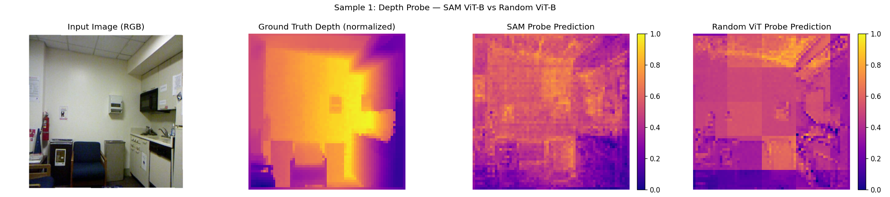
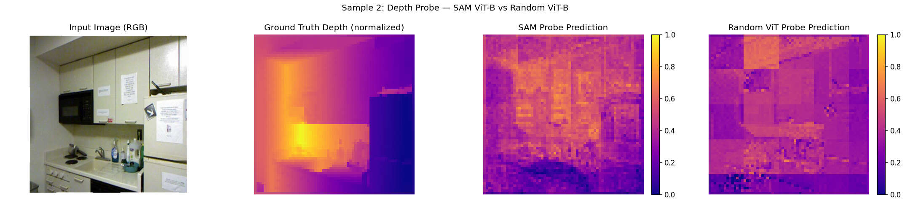

# SAM Depth Probe

This experiment tests whether the frozen SAM ViT-B image encoder linearly encodes monocular depth,
using a randomly initialised ViT of the same architecture as a control baseline.

## Result

A linear probe trained on SAM ViT-B patch features achieves Pearson r = 0.66 against ground-truth
depth on the NYU Depth v2 validation set. An identical probe trained on a randomly initialised ViT-B
achieves r = 0.45. The gap (r = +0.21) indicates that SAM's representations carry meaningful depth
structure beyond what an untrained architecture provides by chance.

This is a small, self-contained exploratory experiment to confirm that a controlled probing
methodology works correctly. It is not a novel finding.

## Results





Full numeric results are in `outputs/results.csv`.

## Setup

**1. Install the segment_anything package from source**

The `segment_anything` package is not on PyPI. Clone the official repository and install it into
your Python environment:

```
git clone https://github.com/facebookresearch/segment-anything
cd segment-anything
pip install -e .
```

Note the path to the directory you cloned into; you will enter it in `config.py` as `SAM_REPO_PARENT`.

**2. Download the SAM ViT-B checkpoint**

Download `sam_vit_b_01ec64.pth` from the
[official SAM model checkpoints page](https://github.com/facebookresearch/segment-anything#model-checkpoints)
and note its path for `config.py`.

**3. Install remaining dependencies**

```
pip install -r requirements.txt
```

**4. Edit config.py**

Open `config.py` and set `SAM_REPO_PARENT` and `SAM_CHECKPOINT` to the correct paths on your
machine. Both variables are clearly marked at the top of the file with comments explaining what
they should point to.

## Running

Full experiment (approximately 15 to 20 minutes with a GPU):

```
python main.py
```

This streams 500 images from NYU Depth v2 (no full dataset download required), extracts patch
features from both encoders, trains two linear probes, prints a comparison table, and saves result
PNGs and `results.csv` to `outputs/`.

To regenerate the visualisations from a saved checkpoint without rerunning the full experiment:

```
python main.py --vis-only
```

To run a quick sanity check without training (3 images only):

```
python smoke_test.py
```

## License

MIT
